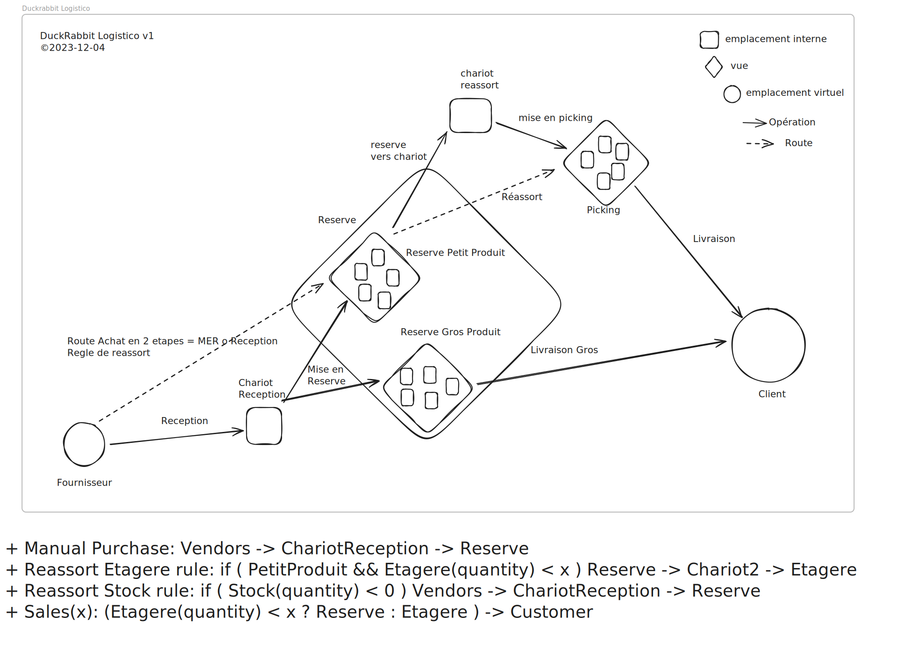

# Process LOGISTICO

[drawing-logistico-process.excalidraw](./drawing-logistico-process.excalidraw)

A tout moment, si quelquechose sort du protocole, il faut ouvrir un tiquet pour demander quoi faire ?

Vous pouvez exécuter toutes les opérations avec l'application "code-barres". Vous pouvez la trouver sur Odoo sous le nom "Code-barres". À partir de là, vous pouvez entrer dans le tableau de bord en appuyant sur "Opérations". De là, vous pouvez lancer une opération en appuyant sur "À TRAITER".

### Réception des colis fournisseurs

1. Apportez les colis en picking et uniquement si cela n'est pas possible, en réserve.
2. Démarrez l'opération "Réception" (dans l'app code-barres).
3. Choisissez la réception que vous souhaitez traiter dans la liste (en vous aidant du nom du fournisseur).
    > **💡 Conseil :** Vous pouvez gagner du temps en scannant un produit du colis. Cela filtrera tous les colis à choisir dans l'application.
4. Après avoir choisi un colis, vous serez invité à scanner un produit du colis. Scannez le produit que vous souhaitez traiter en premier, il sera ajouté et sélectionné.
5. Confirmez la quantité correcte et ajoutez-la soit par des scans répétés, soit en ajoutant manuellement le nombre.
    > **Attention** : Il est possible que la mauvaise quantité ou le mauvais article soit livré, veuillez entrer la quantité que vous avez réellement stockée et lisez la FAQ pour les cas particuliers.
6. Une fois que le champ est coloré en vert, tous les produits ont été ajoutés avec succès au transfert.
7. Stockez le(s) produit(s) ajouté(s) à l'étagère et scannez l'emplacement où vous les avez placés.
8. Répétez les étapes 3 à 6 jusqu'à ce que tous les produits soient traités.
9. Confirmez le transfert en appuyant sur "VALIDER".

### Préparation commande client
1. Préparation des produits
    1. Pour cette opération, vous aurez peut-être besoin d'un panier ou d'un chariot.
    2. Démarrez l'opération "Livraison Produit".
    3. Choisissez une commande que vous souhaitez traiter dans la liste. Notez le numéro de référence de cette commande (par exemple, PROGE/LPP/00070, il sera nécessaire pour les étapes suivantes).
    4. Une liste de produits s'affiche.
    5. Choisissez un produit que vous souhaitez récupérer et allez à la localisation du produit (affichée en haut de la ligne).
    6. Scanner la localisation source.
    7. Scanner le code-barres du produit (ou, si le code-barres ne fonctionne pas, cliquer sur le bouton bleu pour ajouter le produit).
        > Si le produit est manquant, créez immédiatement un ticket en fournissant l'ID du produit ou son code barre (e.g. par exemple, en rouge "[ARST1G] Nice Toy [012345678912]")
    8. Déposer le produit dans un panier et passer au produit suivant jusqu'à avoir traité tous les produits.
2. Packaging et envoi
    1. Revenir au menu d'accueil de Odoo
    2. Ouvrir l'app Inventaire
    3. Cliquer sur "Livraison Produit" (Pas le bouton à traiter)
    4. Cliquer sur la commande que vous venez de traîter (que vous avez retenu à l'étape 1.3)
    5. Vérifiez que vous êtes bien sur la bonne commande en comparant avec la liste de produits affichée
    6. Défiler tout en bas de la page où vous verrez un fichier ZPL. 
        * Télécharger le fichier ZPL à Imprimer
        * Ouvrir l'application Zebra "Printer Setup"
        * Vérifier que l'imprimante est connecté, sinon cliquer sur "Détecter des imprimantes", puis sélectionner une imprimante
        * Ouvrir le fichier ZPL depuis l'application Zebra en cliquant sur "Fichiers Disponibles" puis en selectionnant le premier fichier
        * > Si le fichier est pas affiché, cliquez sur le bouton de menu à gauche et ouvrez la section "Téléchargements"

## FAQ

- Le scan d'un produit génère une erreur.
    > Placez le produit dans la zone désignée pour les réceptions et créez un ticket. (Voir [Créer un Ticket](#ticket))
- Je reçois un colis et la quantité livrée n'est pas correcte.
    > Entrez simplement la quantité réellement livrée et continuez le transfert.
- J'ai traité un transfert mais je ne peux pas appuyer sur "VALIDER".
    > Vérifiez si l'un des produits a une localisation colorée en rouge. Si c'est le cas, appuyez dessus et scannez à nouveau la localisation. Si cela ne fonctionne toujours pas, vous pouvez quitter le transfert et créer un ticket. (Voir [Créer un Ticket](#ticket))

Si probleme à une étape, enregistrer une log note en tagant @support-logistic

### Ajout d'emplacements
* Ouvrir le module "Inventaire"
* Cliquer sur "Configuration" puis "Emplacements"
* Cliquer sur "NOUVEAU"
* Selectionner l'emplacement parent: "PROGE/Stock/Picking"
* Renseigner "Nom de l'emplacement" et "Code-barres" avec le scan du code barre de l'emplacement
* Enregistrer l'emplacement
* si on veut ajouter un autre emplacement, cliquer sur "Action", puis "Dupliquer" et continuer
* Renseigner "Nom de l'emplacement" et "Code-barres" avec le scan du code barre de l'emplacement
* Enregistrer l'emplacement

### Transfert Interne
* Ouvrir le module "Code-Barres"
* Cliquer sur "OPERATIONS"
* Cliquer sur "Transfert internes"
* Cliquer sur NOUVEAU
* Scanner l'emplacement d'origine
* Scanner le produit transférer
* Ajouter les quantités si besoin
* Scanner l'emplacement de destination
* Recommencer l'opération pour chaque groupe de produit si besoin
* Valider le transfert

### Ajustements d'inventaire
* Ouvrir le module "Code-Barres"
* Cliquer sur "Ajustements d'inventaire"
* Scanner l'emplacement
* Scanner le code-barre du produit autant de fois qu'il y a de produits, ou ajuster la quantité
* Répéter l'opération
* Valider en appliquant l'ajustement (cliquer "Appliquer")

### Retour Client (draft)
* Nous Contacter

## FAQ

### Problème: Demande d'Ajout D'emplacement Interne
* Ouvrir le module "Projet"
* Ouvrir le projet "Logistics"
* Ouvrir le template "Ajouter Emplacement(s)..."
* "Action" > "Dupliquer"
* Dans la partie "Description":
  - ajouter la zone parente des nouveaux emplacements ( Réserve ou Picking )
  - ajouter les codes barres des emplacements à créer ( 1 par ligne, avec le scanner )
* Cliquer sur le statut "NOUVEAU"
* Enregistrer

### Problème: Code Barre de produit Introuvable !
* Ouvrir le module "Projet"
* Ouvrir le projet "Logistics"
* Ouvrir le template "Code barre [CODE_BARRE] introuvable"
* "Action" > "Dupliquer"
* Remplacer dans le titre "CODE_BARRE" par le code barre introuvable
* Attacher une photo de la boite du produit introuvable (cliquer sur l'icone du trombonne)
* Cliquer sur le statut "NOUVEAU"
* Enregistrer

### Problème: Dans un transfert réception fournisseur, il y a trop d'occurrences d'un seul produit pour un emplacement en picking
* Mettre le produit dans un emplacement en réserve
* Ouvrir l'application "Code-barres"
* Cliquer sur opérations
* Cliquer sur le bouton bleu dans l'opération **Mise en picking**
* Créer un nouveau transfert
* Scanner le produit en question
* Ouvrir le fichier ZPL depuis l'application Zebra en cliquant sur "Fichier Disponible" puis en selectionnant le fichier

### Problème: problème de correspondance de code-barre entre Odoo et le scanner (problème UPC-EAN)

**Contexte :** Le scanner lit un UPC alors que le code-barre enregistré dans Odoo est un EAN, ce qui peut causer des erreurs de reconnaissance du produit si un zéro précède le code-barre mais n'est pas inclus lors du scan.

**Solution :** Pour résoudre ce problème, suivez ces étapes dans les systèmes Odoo et MaytreeX.

**Dans Odoo :**
1. **Modifier le code-barre :**
   - Naviguez vers **Inventaire > Produits > Produits**.
   - Sélectionnez le produit concerné, retirez le zéro initial du code-barre et cliquez sur **Sauvegarder**.

**Dans MaytreeX :**
1. **Mettre à jour le produit :**
> Pour les opérations suivantes il faut être un employé Duckrabbit et avoir accès aux permissions suivantes dans la MaytreeX: editor, moderator, reviewer
   - Connectez-vous à [MaytreeX](https://maytreex.dr01.duckrabbit.de/products/).
   - Recherchez et sélectionnez le produit, passez-le en mode **Draft** (To archive > Unarchive).
   - Supprimez l'EAN, entrez un UPC sans le zéro initial, puis sauvegardez.
   - Soumettez le produit pour révision en choisissant **Under review** (submit for review) et finalisez par **Approved** (approve).

## Retour Client (draft)
* Nous Contacter

